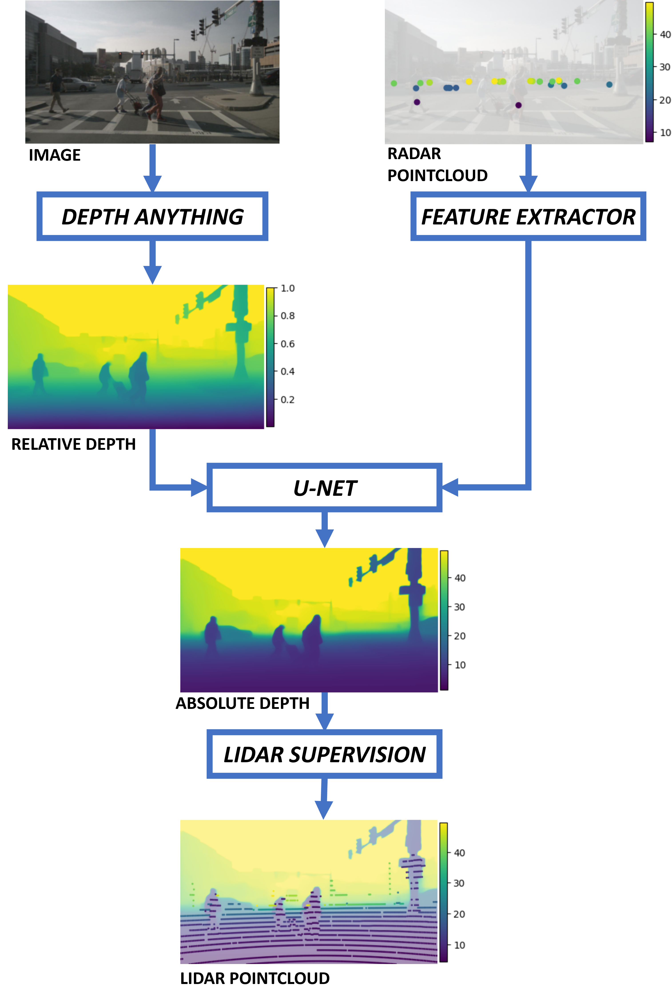
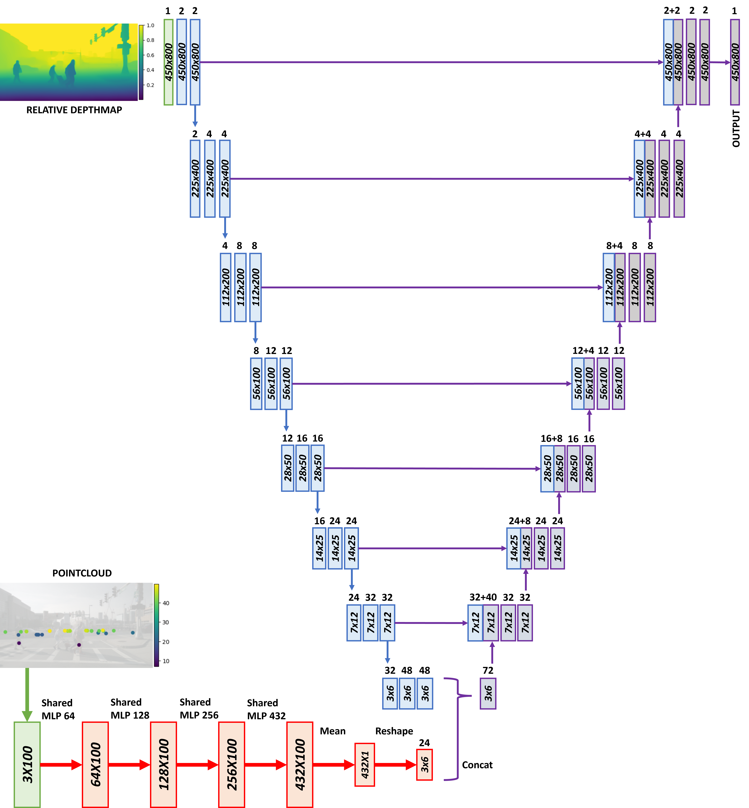

# FUSION RADAR CAMERA BASED ON NEURAL NETWORK

This repository contains the software to perform sensor fusion by using data from images and radar data, trained using the Nuscenes library in two steps:

1. Monocular depth estimation: using existing algorithms for dense depth prediction from a single image, a relative depthmap is created, which is the first input to our algorithm. The employed algorithm here is [Depth Anything](https://depth-anything.github.io/)

2. Using the relative depthmap and the radar measurements, we turn the relative depthmap to an absolute depthmap using a lightweight neural network consisting of a U-net for the image and a PointNet for the radar point to extract their features and fusing them to perform dense depth estimation.

# REQUIREMENTS

We uploaded .yaml files of dependencies for Windows and Nvidia Jetson AGX Orin, using Python 3.8. If you prefer to download the dependencies independently, the main libraries are *nuscenes-devkit*, *torch*, *scikit-image*, [Depth Anything](https://depth-anything.github.io/), which also requires its own libraries.

Also, the Nuscenes dataset is needed (https://www.nuscenes.org/).

# STEPS FOR TRAINING AND TESTING

1. Execute, in order, the files inside the folder *prepare_dataset* modifying the variables *DIR_NUSCENES* (path of the Nuscenes dataset), *VERSION* (Nuscene's version, either the mini or the complete), and *DIR_DATA* (data where the new dataset including the relative depth will be stored). We generate in this step also the relative depthmaps using the last file, and for that the [Depth Anything](https://depth-anything.github.io/) library must be installed from its Github.

2. Inside the *algorithm* folder, the *train_nuscenes.ipynb* and *test_nuscenes.ipynb* files perform training and test. If you change the architecture of the model (the variables *RADAR_CHANNELS_ENCODER*, *UNET_CHANNELS_IMG* and *UNET_CHANNELS_RADAR*) please note that there is a restriction in *RADAR_CHANNELS_ENCODER*, and the last number of the list hast o match the one obtained by the command *model.required_radar_size(depth_data)*, where *depth_data* is any vector of size (BATCH_SIZE, 1, HEIGHT_IMAGE, WIDTH_IMAGE). In *model.py*, there is an example that can be run with *python model.py*

# STEPS FOR INFERENCE

An inference folder that employs TensorRT in C++ is also present. It has been tested in Nvidia ORIN, which supports TensorRT through its Jetpack 5.1. You need to add your Depth Anything model in .onnx format inside the *models* folder. In order to build the package and execute, go to the *inference* folder and type:

```bash
mkdir build
cd build
cmake ..
make
./inference_tensorrt
```

Before building, you may need to adapt the parameters inside the `main.cpp`, which are self-explanatory. To read the samples, you can use those added to the folder *test_data* or use your own. Be aware that using data of different nature from the Nuscenes dataset may cause worse performance. In that case, you should either train the algorithm with your own dataset or perform some augmentation to the Nuscenes dataset to make data more diverse and similar to yours. If `main.cpp` executed correctly, the program will output the inference time in milliseconds, and also display an image with the result, where the LiDAR pointcloud is overlapped.

The TensorRT library and NN handler are within the *libs* folder. Nothing should be changed here. However, TensorRT needs C++17 to run right now because it uses the `filesystem` library. If you need to downgrade to C++14, you'll have to remove the usage of `filesystem` and manage the file reading in other way.

# INSIGHT INTO THE ALGORITHM

## General explanation

This algorithm takes as input an image and a radar point cloud. The image is first independently processed using a relative depth map prediction algorithm, which provides depth values between 0 and 1. The chosen algorithm for this purpose is [Depth Anything](https://depth-anything.github.io/) (Lihe Yang, 2024). It is important to note that this map shows relative distances between pixels (i.e., which pixels are closer and farther from the camera). However, this map is not scaled to real depths because the input image does not have sufficient information. Therefore, the result of this prediction is fused with the radar point cloud using a U-Net based neural network to obtain the final absolute depth map.



## Dataset adaptation

The first step involves adapting the dataset and preparing it to enter the neural network. The input image needs to be adapted for the Depth Anything algorithm, the relative depth map, and the radar point cloud before obtaining their features.

### Image

The image must be resized to a size of 518x518, and then its pixels must be normalized:

1. Divide by 255 so that all numbers are between 0 and 1.
2. Standardize using mean and standard deviation for each channel. Specifically: mean = [0.485, 0.456, 0.406] and std = [0.229, 0.224, 0.225] for the R, G, B channels, respectively.

### Relative depthmap

Once the relative depth map is obtained using the Depth Anything algorithm, it should be normalized to the maximum value so that it ranges between 0 and 1. It should also be resized to the U-Net size, which is 800x450 pixels.

Finally, since initially the algorithm provides inverses of depths (where 0 represents the farthest and 1 the closest), the map is inverted using the simple formula: *relative_depthmap = 1 - relative_depthmap*. Since the map is relative, this operation maintains the relative dependence between pixels (farther means closer to 1, and closer means closer to 0).

### Pointcloud

The assumption is that the point cloud is already in the camera's reference system, and it must undergo several changes before entering the neural network:

1. **Projection using intrinsic parameters**: The point cloud needs to be projected using the intrinsic parameters of the camera. The intrinsic parameters matrix needs to be adjusted due to the resizing of the image. This projection applies to both camera and LiDAR.

2. **Dataset Augmentation** : To achieve dataset augmentation, the option to scale the distance magnitude of the entire point cloud (both radar and LiDAR) has been enabled:
        
- Decrease the depth: All radar and LiDAR points have their distances decreased by the same random number (for example, in one sample, all distances are decreased by 2 meters, and in another sample by 4 meters). The maximum random number to subtract is passed as a parameter.
        
- Multiply distances: All distances are multiplied by the same random scaling factor (assuming the factor is between 0 and 1). The maximum random scaling factor is passed as a parameter.

This dataset augmentation was implemented because it was found that the minimum distance of points in the Nuscenes dataset was much greater than the data generated by our own radar. Therefore, feeding our own data into the neural network resulted in predictions that were inaccurate due to the lack of similar training data. Creating our own dataset would have been ideal but would have required significant time and equipment like LiDAR to generate ground truth, which we do not have. Thus, dataset augmentation techniques using Nuscenes data were applied. Other types of data augmentation can be considered based on specific needs. It's important to apply the same modifications to both radar and LiDAR for each sample.

3. **Point Removal**: Points that fall outside the image margins or exceed certain depth limits are removed. In this case, points with distances less than 0m or greater than 50m are discarded. This adjustment is applied to both radar and LiDAR.

4. **Normalization**: For better neural network conditioning, radar points are normalized:
- X coordinates are divided by the image width,
- Y coordinates are divided by the image height,
- Z coordinates are divided by the maximum considered distance.

This normalization scales all coordinates to be between 0 and 1. This step is not necessary for LiDAR.

5. **Fixed Number of Points**: Before entering the neural network, the radar needs a fixed number of points, which in this case is set to 100. If the initial number of points in the point cloud is less than 100, points are randomly duplicated to reach 100. If there are initially more than 100 points, 100 points are randomly selected.

## Neural Network for Fusing Relative Depth and Radar

The general strategy followed to fuse the relative depth map with radar data involves creating a U-Net architecture. The U-Net takes the relative depth map as input and extracts features using convolutional layers while reducing its dimensionality with pooling layers, forming the encoder. At the end of this encoder, where the image has a smaller dimension, it is concatenated with radar features. The network then gradually increases in size back to the original dimensions using transposed convolutions, which form the decoder. This process results in an image of the same size as the original image, corresponding to the absolute depth map.

Regarding the radar data, starting from a point cloud of size 3x100 (where 100 is the fixed number of points chosen in the previous step), it first undergoes feature extraction using a PointNet-based feature extractor. PointNet extracts features in a way that is invariant to the order of input points. It is based on shared Multilayer Perceptrons implemented using 1D convolutions. It's crucial to ensure that the final dimension of the point cloud matches that of the U-Net's encoder so that they can be concatenated seamlessly.



## Loss function

Three loss functions have been designed that can be combined using weights: depth loss (using LiDAR), structural loss, and consistency loss:

$$
L_{total} = \lambda_{LiDAR} L_{LiDAR} + \lambda_{struct} L_{struct} + \lambda_{consist} L_{consist}
$$

### Depth loss

This loss function simply takes the pixels from the output where there is a projected LiDAR measurement and calculates the L1 distance between the prediction of that pixel and the LiDAR measurement. Only LiDAR points that do not exceed the maximum specified distance (e.g., 50 meters) are considered. Finally, the average of all errors obtained is computed.

### Structural loss

The structural loss is a technique used to ensure that the predicted depth map maintains the same structural relationships as the input depth map. Specifically, it ensures that the relative depth order of pixels remains consistent between the predicted depth map and the input depth map. This is crucial for preserving spatial structure and relative depth information of the scene.

#### Calculation of Local Differences

For each pixel in the depth map, calculate the depth differences between that pixel and its neighboring pixels within a small window (e.g., a 3x3 window).

This is done for both the input depth map (relative depths) and the output depth map (predicted absolute depths).

#### Identifying mismatches

We examine the signs of the calculated differences for both the input and output depth maps. If the signs of the differences are opposite (one is positive and the other is negative), it indicates a mismatch in the relative depth order. For example, if a pixel is closer than its neighbor in the input depth map but farther in the output depth map, this constitutes a mismatch.


#### Calculating the loss

Focus on areas where mismatches occur. The loss is computed by taking the absolute differences in the output depth map at these mismatch points.

### Consistency loss

For deeper regions, it's likely that radar or LiDAR data might be sparse. Therefore, a loss term is added that specifically affects distant positions to maintain consistency with respect to the relative depth map and preserve semantic information for those positions.

## Implementation

The system has been optimized for inference by exporting the model to .ONNX format in C++ using Nvidia Orin with TensorRT. The [Depth Anything](https://depth-anything.github.io/) neural network takes about 40 ms to execute, while our U-Net takes about 3 ms, making the total 43 ms, which enables real-time processing. It's important to note that our network operates based on a relative depth map that can be obtained by any method, not necessarily [Depth Anything](https://depth-anything.github.io/). [Depth Anything](https://depth-anything.github.io/) was chosen for its novelty and high accuracy, but there may be other models (present or future) that streamline the acquisition of relative depth, which is the primary bottleneck as it exceeds the time taken by the U-Net.

## References

- [Yang, L., Kang, B., Huang, Z., Xu, X., Feng, J., & Zhao, H. (2024). Depth anything: Unleashing the power of large-scale unlabeled data. In Proceedings of the IEEE/CVF Conference on Computer Vision and Pattern Recognition (pp. 10371-10381).](https://depth-anything.github.io/)